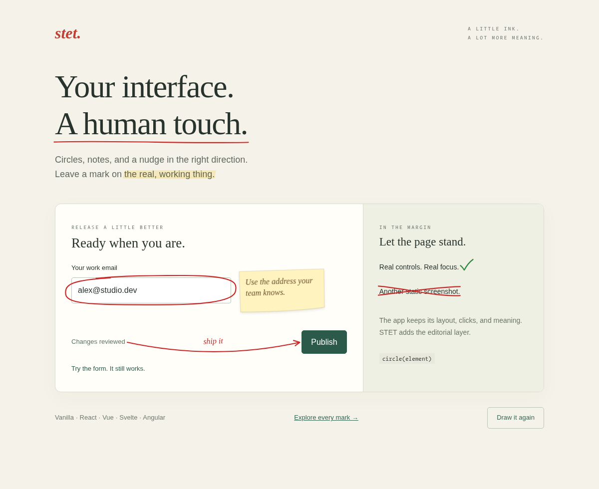

# stet

Hand-sketched margin marks on live UI. Add circles, highlights, arrows, notes,
and proofreader marks without replacing your controls or layout.

The API is under active development and may change
before 1.0. Pin an exact version if you need predictable upgrades.

The library is called **stet**; its npm package is `@funsaized/stet`.
Use `@funsaized/stet` in installation commands and imports.



```sh
npm install @funsaized/stet
```

```js
import { circle } from "@funsaized/stet";
import "@funsaized/stet/style.css";

const save = document.querySelector("#save");
const annotation = circle(save);
```

The real `#save` element still owns focus, clicks, semantics, and layout.

```js
import { underline, highlight, arrow, sticky, mark } from "@funsaized/stet";

underline(heading);
highlight(phrase); // follows wrapped text, including paragraphs
arrow(source, destination, { label: "start here" });
sticky(save, { text: "Ready to ship." });
mark(answer, "right", { description: "Correct answer" });

annotation.refresh();  // follow a layout change, keep the same sketch
annotation.resketch(); // draw a new variation
annotation.destroy(); // remove the annotation and its subscriptions
```

Still by default. Seeded when you need repeatability. Optional hover resketching
and stroke boil honor reduced-motion preferences.

To explore locally: `npm install`, then `python -m http.server 4173` and open
[the live demo](http://localhost:4173/examples/vanilla/) or
[the visual specimens](http://localhost:4173/examples/visual/).

## Dependencies and framework support

**Zero-dependency core, with optional framework adapters.** The core uses browser
DOM, SVG, and CSS APIs, with its own sketch geometry and seeded randomness.

React components, Angular directives, Vue directives, and Svelte actions wrap
the same core functions, handling attachment, updates, and cleanup through their
framework's lifecycle. Import the adapter you need from `@funsaized/stet/react`,
`@funsaized/stet/angular`, `@funsaized/stet/vue`, or `@funsaized/stet/svelte`.
Importing `@funsaized/stet` alone does not load any framework adapter.

React, Angular, and Vue are optional peer dependencies supplied by your app;
installing stet does not install those frameworks. React and Angular adapters
use their frameworks at runtime. The Vue adapter imports only Vue types, and
the Svelte adapter has no Svelte runtime import. Build and test tools are
development dependencies and are not installed as dependencies in your app.

## Coding agents

Stet also ships an optional agent layer: installed-version capability inspection,
validated annotation plans, recoverable skill installation, project discovery,
canonical framework/lifecycle examples and four Agent Skills.
The normal runtime API above stays the same.

After installing `@funsaized/stet`, install project skills for your coding agent:

```sh
npx stet agent init --tool codex
# Also supports claude, cursor and opencode.
```

For deterministic automation, use the installed binary directly:

```sh
./node_modules/.bin/stet inspect --project . --json
./node_modules/.bin/stet snippet --pattern lifecycle --framework react
./node_modules/.bin/stet validate annotation-plan.json --json
```

The agent decides what deserves annotation, validates a source-target plan,
adapts a framework-correct snippet, then checks the application. Plans are
build-time tools and never replace your controls or become runtime selectors.
The CLI requires Node.js 20+; browser imports do not load agent infrastructure.
See the [agent guide](docs/agent-usage.md) for setup, targeting and verification,
and [actual evaluation results](docs/agent-evals.md) for measured outcomes,
retained failures and limitations.

## Documentation

- [Tutorial: annotate your first live interface](docs/tutorial.md)
- [Explanation: how stet marks live UI](docs/explanation.md)
- [API reference](docs/reference.md)
- [Framework examples](examples/)
- [Agent usage](docs/agent-usage.md) and [architecture](docs/agent-architecture.md)
- [GitHub Packages and release process](docs/releases.md)

Supports vanilla JavaScript, React, Vue, Svelte, and Angular. MIT licensed.
