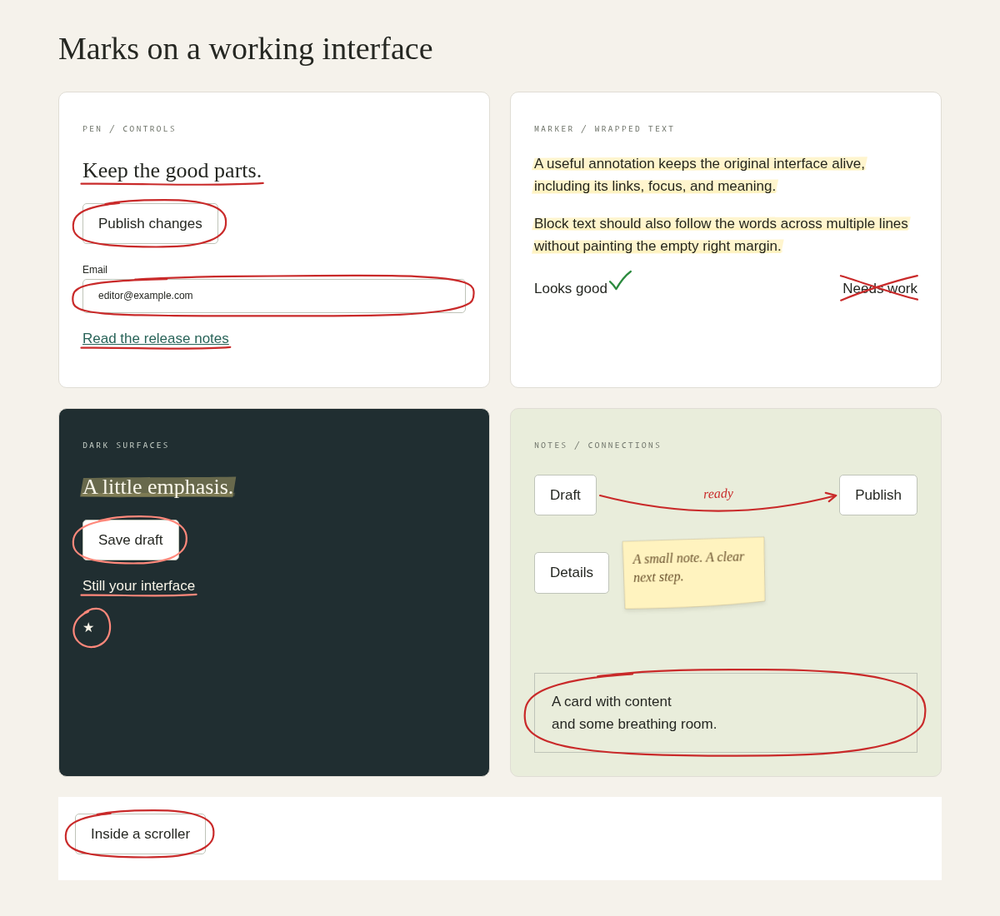

# STET visual product review

Completed September 6, 2026. Baseline: `0bcb4cd581753553053c72ea62bfaebfedee3d13`.
Changes are local and unreleased. This review distinguishes observed improvements
from features and environments that remain unverified.

## 1. Product assessment

STET's strongest idea is editorial feedback on an interface that remains usable.
Circles identify a control, highlights carry emphasis through prose, arrows
connect two real elements, and notes explain why something matters. Its best
use cases are documentation, educational feedback, release announcements,
onboarding hints, and design review. These need a little visual guidance without
a separate tour framework or a screenshot that goes stale.

The original architecture already respected the important boundary: the target
owned layout, native interaction, focus, and semantics. Its six primitives and
five integrations made a useful starting vocabulary. Seeded paths and a tiny
dependency-free core were also worth preserving.

The weak point was the visible product. Nearly every material shared the same
independently jittered, doubled outline. Underlines looked frayed, notes looked
like orange-bordered cards, checks stretched across words, and motion ran even
when there was nothing new to communicate. The minimal demo and screenshot-free
README made the useful concept harder to appreciate.

The reason to install STET over a few custom SVG effects is the combination of
target measurement, text wrapping, scrolling, cleanup, accessible descriptions,
and idiomatic framework lifecycles. Drawing alone does not provide that contract.

## 2. Visual audit

| Primitive | Observed before | Implemented result | Remaining visual limit |
| --- | --- | --- | --- |
| Circle | Tight ellipses cut through control corners; two noisy outlines produced ragged contours. | A continuous open loop, broader shoulders on wide targets, correlated asymmetry, and a short finishing overlap. | Very wide targets become capsule-like; stroke pressure is still uniform. |
| Underline | Repeated small wiggles looked like a frayed border; block headings extended into empty space. | A single bowed Bézier stroke that follows the text's actual line boxes. | Very long lines could benefit from more deliberate entry/exit taper. |
| Highlight | Rounded rectangles, ragged fill edges, tinted text, and whole-paragraph boxes. | Slanted marker ends, broad edges, a darker nib strip, merged text fragments, and one wash per line. | Complex nested blocks and vertical writing require more geometry work. |
| Arrow | Straight doubled shaft, mechanical wings, and a yellow label interrupting the line. | Curved shaft, asymmetric open head aligned to the tangent, and italic labels above horizontal or beside vertical arrows. Labels try to clear the two anchors. | No routing around unrelated controls or other annotations. |
| Sticky | Fixed 160 × 88 card, low-contrast orange text, noisy border, and offscreen placement on mobile. | Warm paper with a faint edge, subtle tilt/shadow, readable ink, content-driven height, and viewport fallback. | Does not resolve collisions with neighboring UI; exceptionally long notes can exceed the viewport. |
| Right mark | A shallow check stretched across the entire target and obscured its text. | A compact check beside text or above a small icon. | Dense interfaces must reserve a little margin. |
| Wrong mark | Two doubled noisy diagonals. | Two clear, slightly bowed pen strokes with a deliberate crossing. | Remains a crossed-off treatment over the target, by design. |

The revised default is a restrained editorial pen with a translucent marker and
warm paper. No named presets were added: changing only colors and roughness
would not justify claims of distinct pencil, Sharpie, or teacher personalities.

## 3. Architecture

The original public module structure remains intact. `src/index.ts` exports the
six attachers and their types. Every framework ultimately calls those attachers.

| Layer | Responsibility |
| --- | --- |
| `src/prng.ts` | Seed generation and deterministic pseudorandom values. |
| `src/rough.ts` | Pure pen, marker, arrow, check, and paper path generation. |
| `src/primitives.ts` | Target-specific geometry, primitive composition, note/label placement. |
| `src/mount.ts` | Body overlays, text rectangles, theme resolution, observers, events, ARIA descriptions, handles, cleanup. |
| `style.css` | Stroke/material styling, typography, stacking, optional boil, forced colors, reduced motion. |
| Framework entry points | Ref/directive/action lifecycle and option changes; no drawing code. |

A primitive validates and snapshots its options, mounts a fixed body-level
overlay, measures the target, and supplies one or more path generators. The SVG
is decorative; meaningful text is ordinary DOM associated with the target.
Resize, captured scroll, font loading, and intersection notifications trigger
updates. `refresh()` remeasures without changing the seed. Unchanged path markup
retains its DOM nodes. Destruction removes subscriptions, overlays, and only
the ARIA tokens belonging to that annotation.

The core still uses per-instance observers and listeners. It does not continuously
poll layout and does not introduce an animation-frame tracking loop. Geometry
and DOM lifecycle remain partly colocated in the small mount module; splitting
that further would not have improved this pass's visible result.

## 4. Highest-leverage findings

The implementation followed this order:

1. **Tier 1: material-specific drawing.** A pen, highlighter, and sheet of paper
   should not be three uses of the same jittered rounded rectangle.
2. **Tier 1: useful placement.** Word-level text measurement, compact checks,
   visible notes, and readable arrow labels matter more than extra shapes.
3. **Tier 1: quiet defaults.** Continuous motion weakened the editorial effect
   and made dense pages distracting.
4. **Tier 2: expressive but small API.** `refresh()`, `description`, and signed
   arrow `curvature` address concrete application needs without a large config.
5. **Tier 2: show the product.** The working form demo and visual README make
   the value visible before implementation details.
6. **Tier 3: protect the result.** Browser screenshots and adapter lifecycle
   regressions follow the visual work; broad architectural replacement did not.

For context, [Rough Notation](https://roughnotation.com/) demonstrates the value
of a short visual gallery, text annotations, and optional animation sequencing.
[Rough.js](https://roughjs.com/) separates drawing primitives and roughness/bowing
controls. STET's opportunity is its editorial vocabulary around live controls,
including two-target arrows and meaningful notes across five integrations.
The note placement follows the general lesson of trying another side before
shifting inside the viewport, also explained by [Floating UI](https://floating-ui.com/docs/flip).
No competitor code or runtime dependency was added.

## 5. Improvements implemented

**Pen gestures.** The original point-by-point noise had no relationship to the
overall movement of a hand. Long Bézier gestures and correlated circle variation
reduce small, arbitrary wiggles. Open closure gives a circle a visible finishing
stroke. Wider shoulders provide more room around rectangular controls.

**Marker geometry and compositing.** A doubled outline used as a fill was a poor
model of a highlighter. A dedicated wash now has slanted ends, gently varying
edges, and a second translucent edge strip. Blending happens at the overlay so
dark glyphs remain clear. A semantic blend token supports light text on dark UI.

**Text measurement.** Paragraphs and headings previously inherited their block
width, while mixed text/code could generate overlapping bands. Text ranges and
line merging follow the words and avoid redundant overlapping fragments. A
Svelte heading with a tight line-height also now gets its underline below the
glyphs instead of through their lower edge.

**Arrows.** The shaft and head now share a curved trajectory. Heads scale down
for short gaps. Labels follow that trajectory, switch sides for vertical arrows,
try to avoid the anchors, and fit their text within the viewport. Coincident
anchors no longer produce `NaN` coordinates.

**Notes.** Measured text replaces the rigid fixed-height box. Notes try available
sides using actual dimensions, then shift within a viewport gutter. Brown ink,
italic fallback typography, lightly irregular paper, a slight rotation, and a
small shadow give the note a distinct material. The layer remains click-through.

**Motion and lifecycle.** Default boil and pointer resketch are now off. Optional
motion responds to preference changes while mounted. Offscreen/fully clipped
targets hide their annotations, font loading refreshes measurement, and calls
on destroyed handles cannot recreate overlays. The new `refresh()` keeps an
annotation attached after application-driven movement without changing its seed.

**Integrations.** React detects a replacement DOM node behind a stable ref.
Vue deeply tracks reactive bindings and compares stored snapshots. Svelte
snapshots options and supports parameterless simple actions. Shared rendering,
descriptions, defaults, and cleanup continue to come from vanilla.

## 6. Visual improvements and comparisons

[Original specimens](visual/specimens-before.png) ·
[Revised specimens](visual/specimens-after.png)



The specimen comparison uses the same seed/target layout for the shared
primitives. The dark panel additionally demonstrates the new scoped blend token.
The original frame has visibly noisy outlines and block-wide paragraph fill;
the revised frame has calmer contours, separate text strokes, and a readable
paper note. The finishing overlap remains visible at high DPI.

[Original demo](visual/vanilla-before.png) ·
[New working demo](visual/vanilla-after.png) ·
[Mobile form](visual/vanilla-mobile.png)

The demo comparison includes intentional page-design changes and is not a
renderer-only comparison. The browser fixture additionally covers images,
scaled/rotated controls, code fragments, and nested scrolling. Screenshots were
inspected during multiple iterations, including mobile, forced colors, and 2×
device pixel ratio. The geometry remains axis-aligned around rotated targets.

## 7. API changes

Existing attacher names and signatures remain usable. Additions are:

```ts
const note = circle(element, { description: "This field is required" });
note.refresh();
arrow(from, to, { label: "next", curvature: -0.2 });
```

Svelte's simplest form is now `use:circle`. Scoped tokens support ink, paper,
font, stacking, and highlight compositing. No global registry, presets, hooks
collection, or configuration controller was added.

Behavior changes are documented in the changelog: still defaults, 2.2px pen
width, compact checks, 176px notes with a 14px gap, side fallback, z-index 1000,
and new paths for existing seeds. Consumers relying on old screenshots or exact
placement should review the changes before upgrading. Existing motion can be
requested with `{ boil: 0.3, resketchOnHover: true }`.

Vanilla options are copied at attachment. For option changes, destroy and
reattach; a true in-place `update()` handle is deliberately deferred so it can
have one consistent contract for text, seeds, semantics, and targets.

## 8. Cross-framework verification

| Environment | Checked |
| --- | --- |
| Vanilla | All primitives in both demos; native input/focus/submission; refresh, resketch, destroy; browser geometry and accessibility assertions. |
| React 19 | Production example build and desktop/mobile rendering; live query UI; real React tests for Strict Mode, stable refs with new DOM nodes, unchanged props, option/label updates, null refs, and cleanup. |
| Vue 3 | Runnable browser example with every directive; reactive ink and note text updates; unmount removes overlays/descriptions; a real Vue reactive binding regression test. |
| Svelte 5 | Example build and `svelte-check`; desktop/mobile rendering, counter-driven note updates, and transformed logo; action tests for unchanged/edited options and omitted parameters. |
| Angular 20 | Partial library compilation and production example build; all seven rendered marks on desktop/mobile; note viewport fallback. |

The conceptual contract is shared; syntax stays idiomatic. Angular options
should be replaced to trigger input changes. Vue reactive edits and Svelte
action updates follow their own frameworks' update mechanisms. Updates that
reattach an unseeded annotation may produce a new sketch; supply a seed when
visual stability matters across option updates.

React 18, Angular 21, framework SSR/hydration suites, and real screen readers
were not exercised. Client-only lifecycle boundaries were inspected, but that
is not equivalent to a full hydration test matrix.

## 9. Performance

Controlled local Chromium 153 benchmark: five rounds per count, median mount
time, and median per-event synchronous cost across twenty scroll events per
round. Both versions used the same 100 × 32px buttons, fixed seeds, and default
options, with no demo page around them.

| Circles | Mount before → after | Scroll callback work before → after | Paths before → after | Active animations before → after |
| --- | --- | --- | --- | --- |
| 1 | 0.30 → 0.20 ms | 0.14 → 0.06 ms | 3 → 1 | 1 → 0 |
| 10 | 2.20 → 1.40 ms | 1.19 → 0.53 ms | 30 → 10 | 10 → 0 |
| 50 | 12.10 → 9.80 ms | 7.71 → 4.40 ms | 150 → 50 | 50 → 0 |
| 100 | 34.90 → 29.70 ms | 19.74 → 14.05 ms | 300 → 100 | 100 → 0 |

These are synthetic callback timings, not full frame-time or memory profiles.
The performance improvement includes the deliberate change to still defaults.
It does not establish that 100 annotations will maintain a particular frame
rate in a complex app. At that scale, shared scheduling and avoiding repeated
geometry generation remain worthwhile.

Final size guard: **5.98 KB core + 1.11 KB CSS gzip**, measured with the existing
unminified-file concatenation method. Baseline was 4.38 KB + 0.79 KB. The original
6 KB core / 3 KB CSS limits still pass. There are no runtime dependencies; the
added packages are browser/React development-test dependencies.

Reproduce the before/after benchmark with:

```sh
npm run benchmark -- 0bcb4cd581753553053c72ea62bfaebfedee3d13
```

## 10. Accessibility

Targets still own focus, clicks, keyboard behavior, forms, and layout.
Decorative SVG stays `aria-hidden`. Notes, arrow labels, and optional
descriptions use DOM text and `aria-describedby`. Cleanup preserves preexisting
IDs and descriptions added later by the application. Description IDs avoid
existing document IDs.

Reduced-motion changes are observed live. Forced colors use system ink and
outlined highlights; checks and crosses remain distinct without color.
Default note ink is substantially darker than the old orange. No annotation
adds a tab stop or intercepts target clicks.

Limits: screenshots and accessible-description assertions are not a WCAG
certification. Contrast depends on the application's chosen colors and
compositing. Use the dark-surface blend token where appropriate. Very long
notes and constrained high-zoom layouts need further placement design.

## 11. Validation

- 36 unit/lifecycle tests pass, including real React and Vue runtimes.
- 18 browser tests pass across Chromium and Firefox, including a final run
  against saved baselines without updating them.
- Six reviewed browser baselines cover desktop specimens, mobile notes, and
  forced colors in both engines.
- TypeScript checking, Angular partial compilation, React/Svelte/Angular example
  builds, Svelte checking, and the bundle-size guard pass.
- Package contents/exports were inspected with `npm pack --dry-run`; no package
  was published. The working tree passes `git diff --check`.
- Visual inspection covered buttons, headings, inline and block text, links,
  input controls, cards, icons, images, tight and spacious layouts, nested
  scrolling, transformed targets, light/dark/colored surfaces, desktop/mobile,
  and 2× device pixel ratio.

WebKit was downloaded and a launch was attempted, but the host lacks the
required `libicu74`, `libxml2`, and `libflite1` dependencies. It remains an opt-in
project (`STET_WEBKIT=1`) pending a supported host and reviewed baselines.
Native browser zoom, Safari/iOS devices, and cross-document targets were not
verified. The existing Svelte static preview also has an unrelated absolute
icon-sprite path that needs a root-served dev server for those app icons.

## 12. Remaining opportunities

Highest value next: pressure/taper experiments using real pen references;
optional brief draw-on motion; a typed `update()` contract; and shared geometry
scheduling for large sets. Keep those experiments behind side-by-side rendered
comparisons rather than introducing cosmetic preset names first.

Geometry work still worth doing includes partial scroll-container clipping,
movement without resize, top-layer dialogs, transformed/zoomed root containers,
very long note handling, vertical text, and routing around nearby annotations.
Current notes and labels only provide lightweight viewport/anchor collision
handling. They are not a general placement engine.

The library does not add freeform drawing, brackets, boxes, numbered tours,
groups, persistence, or sequencing in this pass. Those should compete for
space with proven user needs rather than expand the primitive list by default.

## 13. Recommended direction

Make STET the small editorial layer developers reach for when they want to
explain, correct, or celebrate something in a working interface. Keep the calm
pen/marker/paper default recognizable, and make the visual specimen gallery
part of every renderer change.

For the next release, ship this visual foundation with explicit migration
notes. Then prioritize controlled appearance/disappearance and option updates
for real documentation and onboarding use. Follow with measured large-set
tracking improvements and a stronger browser/framework compatibility matrix.
Add another visual personality only after its rendered output is convincingly
different and useful enough to deserve an API.
